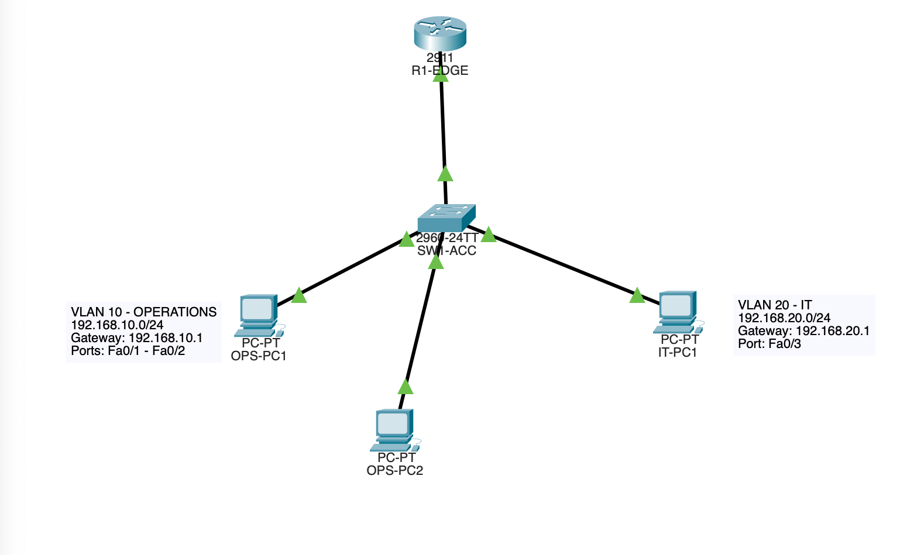
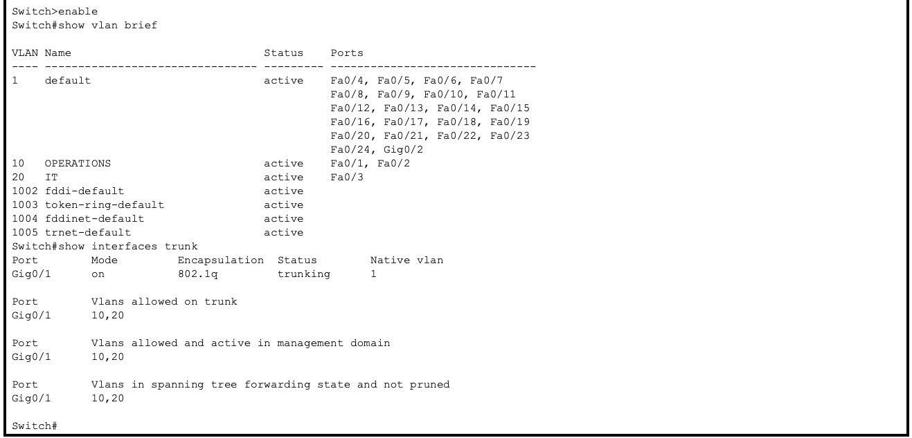
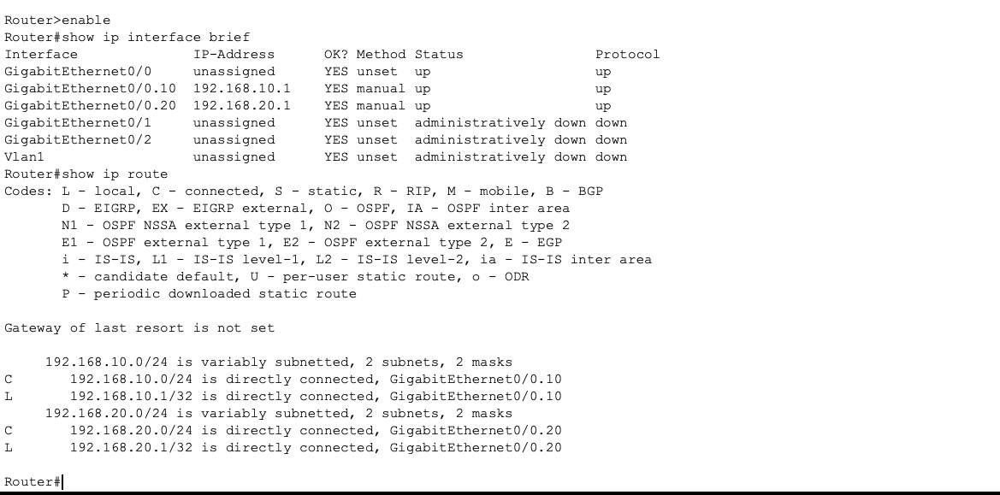
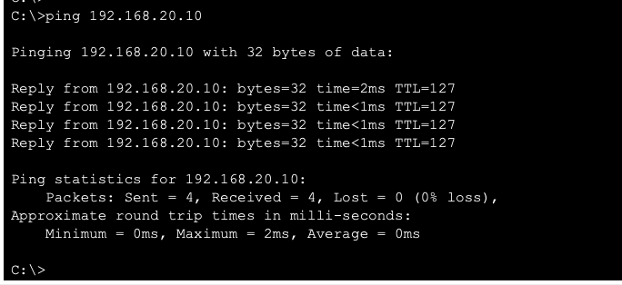

# VLAN & Inter-VLAN Routing Lab

## Overview

This lab was built in Cisco Packet Tracer to practice VLAN segmentation and routing between separate networks.

I created two VLANs on a Cisco switch, assigned devices to each VLAN, configured an 802.1Q trunk between the switch and router, and used router-on-a-stick to allow devices in different VLANs to communicate.

The lab was completed by configuring and verifying the network through the Cisco IOS CLI.

## Network Topology



### Devices Used

- 1 Cisco 2911 Router — R1-EDGE
- 1 Cisco 2960 Switch — SW1-ACC
- 3 PCs — OPS-PC1, OPS-PC2, IT-PC1
- Copper straight-through Ethernet connections

## VLAN & IP Addressing

| Device | VLAN | IP Address | Subnet Mask | Default Gateway |
|---|---|---|---|---|
| OPS-PC1 | 10 - OPERATIONS | 192.168.10.10 | 255.255.255.0 | 192.168.10.1 |
| OPS-PC2 | 10 - OPERATIONS | 192.168.10.20 | 255.255.255.0 | 192.168.10.1 |
| IT-PC1 | 20 - IT | 192.168.20.10 | 255.255.255.0 | 192.168.20.1 |

### VLANs

- VLAN 10 — OPERATIONS — `192.168.10.0/24`
- VLAN 20 — IT — `192.168.20.0/24`

## Switch Configuration

I created VLAN 10 and VLAN 20 and assigned the PC-facing switch ports as access ports.

```text
vlan 10
 name OPERATIONS

vlan 20
 name IT

interface range fa0/1 - 2
 switchport mode access
 switchport access vlan 10

interface fa0/3
 switchport mode access
 switchport access vlan 20
```

The connection from SW1-ACC to R1-EDGE uses GigabitEthernet0/1 as an 802.1Q trunk carrying both VLANs.

```text
interface gi0/1
 switchport mode trunk
 switchport trunk allowed vlan 10,20
```

## Router-on-a-Stick Configuration

R1-EDGE uses two logical subinterfaces on GigabitEthernet0/0.

Each subinterface is associated with a VLAN using 802.1Q encapsulation and acts as the default gateway for that VLAN.

```text
interface gigabitEthernet 0/0
 no shutdown

interface gigabitEthernet 0/0.10
 encapsulation dot1Q 10
 ip address 192.168.10.1 255.255.255.0

interface gigabitEthernet 0/0.20
 encapsulation dot1Q 20
 ip address 192.168.20.1 255.255.255.0
```

## Verification

### VLAN and Trunk Verification

I used `show vlan brief` to verify the access-port assignments and `show interfaces trunk` to confirm that Gi0/1 was actively trunking VLANs 10 and 20.



### Router Verification

`show ip interface brief` confirmed that both router subinterfaces were up/up.

`show ip route` showed both VLAN networks as directly connected routes.



### Inter-VLAN Connectivity

OPS-PC1 in VLAN 10 was able to successfully ping IT-PC1 in VLAN 20.

```text
OPS-PC1 (192.168.10.10)
        ↓
Default Gateway (192.168.10.1)
        ↓
R1-EDGE
        ↓
VLAN 20 Gateway (192.168.20.1)
        ↓
IT-PC1 (192.168.20.10)
```

The final ping test returned 4 out of 4 replies with 0% packet loss.



## Troubleshooting

During the initial build, communication between VLAN 10 and VLAN 20 failed because Layer 3 routing had not yet been configured.

The switch could forward traffic between devices in the same VLAN, but traffic destined for another subnet required a default gateway and router.

The router's physical GigabitEthernet0/0 interface was also initially administratively down. After enabling the interface with `no shutdown` and configuring the VLAN subinterfaces, inter-VLAN communication succeeded.

The first successful inter-VLAN test lost one ping while ARP information was being learned. Repeating the test resulted in 4/4 successful replies.

## What I Learned

This lab helped reinforce the relationship between Layer 2 switching and Layer 3 routing. I practiced:

- Creating and assigning VLANs
- Configuring access ports
- Configuring an 802.1Q trunk
- Understanding tagged VLAN traffic
- Configuring router subinterfaces
- Using default gateways
- Routing between separate IP networks
- Reading connected and local routes
- Using Cisco IOS verification commands
- Troubleshooting interface and connectivity issues
- Saving running configurations to startup configurations

## Lab File

The completed Cisco Packet Tracer `.pkt` file is included in this repository so the topology and configurations can be reviewed directly.
